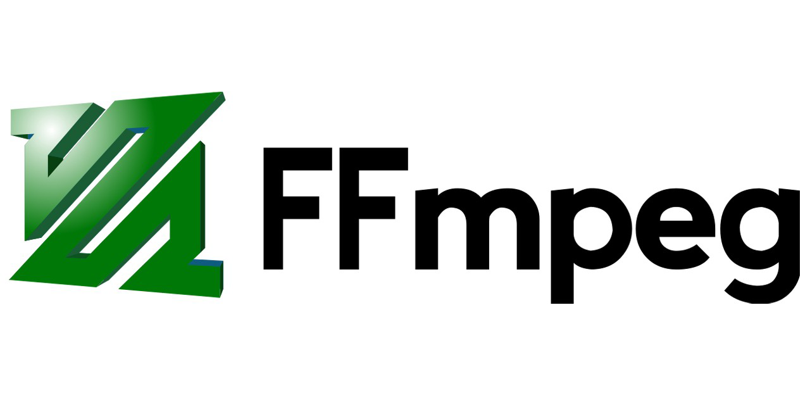

## FFmpeg入门

测试视频：

[](https://www.youtube.com/watch?v=Zfczinxjy-c&list=PLLvc0-MNtbKVbHv22Sn-YuiwYC5heRSkd "樱花庄")

## 一、Tutorial1——视频截帧保存
https://github.com/wlxklyh/FFMpegStudy/blob/master/win/Tutorial1
这个是9361帧的截图 


流程说明：
1. 初始化
av_register_all()
AVFormatContext pFormatCtx = avformat_alloc_context()
2. 打开文件（会读取header）
avformat_open_input(pFormatCtx,filepath)
3. 检查和获取流信息的API
avformat_find_stream_info()
av_dump_format()
4. 从pFormatCtx中得到那个streamsindex是视频流
pFormatCtx->stream[i]->codec->codec_type == ACMEIDIA_TYPE_VIDEO 
5. 从视频流里面得到CodeContext 编解码上下文
6. 从而得到解码器
7. 读取帧
   av_read_frame 得到avpacket(存储的可能是视频流 也可能是音频流)
8. 判断avpacket是不是视频流
9. 从读取出的avpacket中读取AVFrame出来
10. 用sws_scale转AVFrame的格式 大多可能是YUV 我们要转成RGB保存
11. SaveFrame
    fwrite(frame->data[0]+pFrame->linesize[0],1,width*3,pFile)

```cpp
#include "stdafx.h"
#include <fstream>

//将 AVFrame 保存成图片文件  ppm格式
void SaveFrame(AVFrame* pFrame, int width, int height, int iFrame)
{
	//（1）文件名
	char szFileName[32];
	sprintf(szFileName, "frame%04d.ppm", iFrame);


	//（2）打开文件
	FILE *pFile;
	pFile = fopen(szFileName, "wb");
	if (pFile == NULL)
	{
		return;
	}

	//（3）写入ppm文件的文件头 
	fprintf(pFile, "P6\n%d %d\n255\n", width, height);

	//（4）写入ppm文件的内容
	for (int i = 0; i < height; i++)
	{
		fwrite(pFrame->data[0] + i * pFrame->linesize[0], 1, width * 3, pFile);
	}
}


int _tmain(int argc, _TCHAR* argv[])
{
	//文件名字 
	char filepath[] = "nwn.mp4";

	//(1)这里注册了所有的文件格式和编解码器的库 所以他们将被自动的使用在被打开的合适格式的文件  只需要注册一次
	av_register_all();
	avformat_network_init();
	AVFormatContext *pFormatCtx;
	pFormatCtx = avformat_alloc_context();

	//(2)打开一个文件 打开之后pFormatCtx就有有了文件句柄  这个会打开文件且读取Header
	if (avformat_open_input(&pFormatCtx, filepath, NULL, NULL) != 0) 
	{
		return -1;
	}

	//(3)检查在文件中的流的信息
	if(avformat_find_stream_info(pFormatCtx,0)<0)
	{
		return -1;
	}

	//(4)dump下信息
	av_dump_format(pFormatCtx,0, filepath,0);


	AVCodecContext *pCodecCtx;
	int videoStream = -1;
	//pFormatCtx->Streams 仅仅是一组pFormatCtx->nb_streams 的指针 包含了哪些流
	for(int i=0; i<pFormatCtx->nb_streams;i++)
	{
		if(pFormatCtx->streams[i]->codec->codec_type == AVMEDIA_TYPE_VIDEO)
		{
			videoStream = i;
			break;
		}
	}

	if(videoStream == -1)
	{
		return -1; 
	}

	pCodecCtx = pFormatCtx->streams[videoStream]->codec;

	AVCodec *pCodec;


	pCodec = avcodec_find_decoder(pCodecCtx->codec_id);

	if(pCodec == NULL)
	{
		fprintf(stderr, "Unsupported codec!\n");
		return -1;
	}

	if(avcodec_open(pCodecCtx,pCodec) < 0)
	{
		return -1;
	}

	AVFrame *pFrame;
	pFrame = avcodec_alloc_frame();

	AVFrame *pFrameRGB = avcodec_alloc_frame();
	if(pFrameRGB == NULL)
	{
		return -1;
	}
	uint8_t *buffer;
	int numBytes;
	numBytes = avpicture_get_size(PIX_FMT_RGB24, pCodecCtx->width, pCodecCtx->height);

	buffer = (uint8_t*)av_malloc(numBytes * sizeof(uint8_t));

	//数据是从buffer来的  这里相当于是pFrameRGB初始化数据 可能是个黑色的图片
	avpicture_fill((AVPicture*)pFrameRGB, buffer, PIX_FMT_RGB24, pCodecCtx->width, pCodecCtx->height);


	int frameFinished;
	AVPacket packet;
	int i = 0;
	//（5）循环从Steams中 读取出frame packet通常包含一个压缩的Frame 音频则可能是多个Frame
	while(av_read_frame(pFormatCtx,&packet)>=0)
	{
		//stream_index Packet所在stream的index 通过这个来判断是不是视频帧
		if(packet.stream_index == videoStream)
		{
			//把视频帧解压到Frame中
			avcodec_decode_video2(pCodecCtx,pFrame,&frameFinished,&packet);
			if(frameFinished)
			{
				//旧版本
				//img_convert((AVPicture *)pFrameRGB, PIX_FMT_RGB24,(AVPicture*)pFrame, pCodecCtx->pix_fmt,pCodecCtx->width, pCodecCtx->height);
				//转换参数 
				SwsContext *img_convert_ctx = sws_getContext(pCodecCtx->width, pCodecCtx->height, pCodecCtx->pix_fmt, pCodecCtx->width, pCodecCtx->height, PIX_FMT_RGB24, SWS_BICUBIC, NULL, NULL, NULL);
				//转换
				sws_scale(img_convert_ctx, (const uint8_t* const*)pFrame->data, pFrame->linesize, 0, pCodecCtx->height, pFrameRGB->data, pFrameRGB->linesize);
				++i;
				if( i%120 == 1)
				{
					SaveFrame(pFrameRGB, pCodecCtx->width, pCodecCtx->height, i);
				}
			}
			av_free_packet(&packet);
		}
	}
	av_free(buffer);
	av_free(pFrame);
	av_free(pFrameRGB);

	avcodec_close(pCodecCtx);

	avformat_close_input(&pFormatCtx);


	return 0;
}
```
## 二、Tutorial2——视频显示到屏幕（SDL）
https://github.com/wlxklyh/FFMpegStudy/blob/master/win/Tutorial2

跟Tutorial1大致一致 除了SDL部分 和 Frame编码为YUV
1. SDL部分
```cpp
SDL_Init//SDL初始化
SDL_Surface* screen = SDL_SetVideoMode//初始化一个屏幕
SDL_Overlay* bmp = SDL_CreateYUVOverlay//有点像Screen上面的一个View
//YUVOverlay  赋值
SDL_LockYUVOverlay 
bmp->pixels[0] = nowYUVAVFrame->data[0];
...
bmp->pitches[0] = nowYUVAVFrame->linesize[0];
...
//显示
SDL_DisplayYUVOverlay
```
2. Frame编码为YUV
注意Frame的初始化 格式是PIX_FMT_YUV420P
avpicture_get_size(PIX_FMT_YUV420P, avcodecContext->width, avcodecContext->height);
sws_scale 转换的时候格式是PIX_FMT_YUV420P


流程说明：
1. 初始化编码器库
2. 打开视频文件 avformat_open_input
3. 查找视频流 pFormatCtx->stream[i]->codec_type == VEDIO
4. 得到解码器上下文 pFormatCtx->stream[vedioIndex]->codec
5. 得到解码器 avcode_find_decoder(avVideoCondecCtx)
6. 打开解码器 avcode_open
7. 帧初始化 AVFrame  avpicture_fill
8. SDL初始化  SDL_Surface SDL_Overlay
9. 初始化一个packet av_new_packet
10. 逐帧读取 av_rean_frame 
    1.  如果是视频流avcodec_decode_video 解码
    2.  转换上下文 swscontext
    3.  sws_scale转换成NowYUVFrame
    4.  赋值SDL_Overlay
    5.  显示SDL_DisplayYUVOverlay

```cpp
#include "stdafx.h"
#include <fstream>

int _tmain(int argc, _TCHAR* argv[])
{
	char filepath[] = "nwn.mp4";

	//(1)这里注册了所有的文件格式和编解码器的库 所以他们将被自动的使用在被打开的合适格式的文件  只需要注册一次
	av_register_all();
	avformat_network_init();
	AVFormatContext  *pFormatContext = avformat_alloc_context();

	//(2)打开文件
	if(avformat_open_input(&pFormatContext,filepath, NULL, NULL)!=0)
	{
		//打开失败
		return -1;
	}

	//(3)打印信息
	if (av_find_stream_info(pFormatContext) < 0)
	{
		printf("Couldn't find stream information.\n");
		return -1;
	}
	av_dump_format(pFormatContext, 0, filepath, 0);


	//(4)查找视频流
	int vedioIndex = -1;
	for(int i=0;i<pFormatContext->nb_streams;i++)
	{
		if(pFormatContext->streams[i]->codec->codec_type == AVMEDIA_TYPE_VIDEO)
		{
			vedioIndex = i;
			break;
		}
	}
	if(vedioIndex == -1)
	{
		return -1;
	}

	//(5)得到视频流的解码器
	AVCodec * avcodec;
	AVCodecContext * avcodecContext;
	avcodecContext = pFormatContext->streams[vedioIndex]->codec;
	avcodec = avcodec_find_decoder(avcodecContext->codec_id);
	if (avcodec == NULL)
	{
		fprintf(stderr, "Unsupported codec!\n");
		return -1;
	}
	if (avcodec_open(avcodecContext, avcodec) < 0)
	{
		return -1;
	}

	//(6)帧初始化
	AVFrame *nowAVFrame = avcodec_alloc_frame();
	AVFrame *nowYUVAVFrame = avcodec_alloc_frame();
	if (nowAVFrame == NULL || nowYUVAVFrame == NULL)
	{
		return -1;
	}
	uint8_t *buffer;
	int numBytes;
	numBytes = avpicture_get_size(PIX_FMT_YUV420P, avcodecContext->width, avcodecContext->height);
	buffer = (uint8_t*)av_malloc(numBytes * sizeof(uint8_t));
	//数据是从buffer来的  这里相当于是pFrameRGB初始化数据 可能是个黑色的图片
	avpicture_fill((AVPicture*)nowYUVAVFrame, buffer, PIX_FMT_YUV420P, avcodecContext->width, avcodecContext->height);

	//-------SDL
	if (SDL_Init((SDL_INIT_VIDEO | SDL_INIT_AUDIO | SDL_INIT_TIMER)))
	{
		return -1;
	}
	SDL_Rect rect;
	SDL_Surface* screen = SDL_SetVideoMode(avcodecContext->width,avcodecContext->height,0,0);
	SDL_Overlay* bmp = SDL_CreateYUVOverlay(avcodecContext->width, avcodecContext->height, SDL_YV12_OVERLAY, screen);
	//-------SDL

	int frameFinished;
	AVPacket *packet = (AVPacket *)malloc(sizeof(AVPacket));
	int y_size = avcodecContext->width * avcodecContext->height;
	av_new_packet(packet, y_size);
	int i = 0;
	//（6）循环从Steams中 读取出frame packet通常包含一个压缩的Frame 音频则可能是多个Frame
	while (av_read_frame(pFormatContext, packet) >= 0)
	{
		//stream_index Packet所在stream的index 通过这个来判断是不是视频帧
		if (packet->stream_index == vedioIndex)
		{
			//把视频帧解压到Frame中
			avcodec_decode_video2(avcodecContext, nowAVFrame, &frameFinished, packet);
			if (frameFinished)
			{
				//转换参数 
				SwsContext *img_convert_ctx = sws_getContext(avcodecContext->width, avcodecContext->height, avcodecContext->pix_fmt, avcodecContext->width, avcodecContext->height, 
					PIX_FMT_YUV420P, SWS_BICUBIC, NULL, NULL, NULL);
				//转换
				sws_scale(img_convert_ctx, (const uint8_t* const*)nowAVFrame->data, nowAVFrame->linesize, 0, avcodecContext->height, nowYUVAVFrame->data, nowYUVAVFrame->linesize);

				//-------SDL
				SDL_LockYUVOverlay(bmp);
				bmp->pixels[0] = nowYUVAVFrame->data[0];
				bmp->pixels[2] = nowYUVAVFrame->data[1];
				bmp->pixels[1] = nowYUVAVFrame->data[2];
				bmp->pitches[0] = nowYUVAVFrame->linesize[0];
				bmp->pitches[2] = nowYUVAVFrame->linesize[1];
				bmp->pitches[1] = nowYUVAVFrame->linesize[2];
				SDL_UnlockYUVOverlay(bmp);

				rect.x = 0;
				rect.y = 0;
				rect.w = avcodecContext->width;
				rect.h = avcodecContext->height;
				SDL_DisplayYUVOverlay(bmp, &rect);
				//延时40ms
				SDL_Delay(40);
				//-------SDL
			}
			av_free_packet(packet);
		}
	}

	av_free(buffer);
	av_free(nowAVFrame);
	av_free(nowYUVAVFrame);
	avcodec_close(avcodecContext);
	avformat_close_input(&pFormatContext);


	return 0;
}


```
## 三、Tutorial3——播放音频
https://github.com/wlxklyh/FFMpegStudy/blob/master/win/Tutorial3
播放视频的代码请看Tutorial2这里只说播放音频的
 
跟播放视频不一样的地方：
1. 要解码音频 然后塞入到一个队列
2. 读取音频的是在另外一个线程的回调 所以主线程是生产者（生产packet）、音频线程是消费者（消耗packet）
3. 主线程解码音频的过程跟解码视频的类似 逐帧解码后塞入队列packet_queue_put
4. 回调是异步线程需要取队列packet_queue_get 然后

音频解码流程：

1. 查找音频流 
2. 得到音频流解码器上下文
3. 得到音频解码器
4. 打开音频解码器
5. 帧初始化
6. 逐帧得到音频的packet 
7. 把音频packet塞入队列
8. 回调函数audio_callback
   1. 取出一帧的数据：audio_decode_frame
      1. 从队列里面取出一个：packetpacket_queue_get 
      2. 音频解码：avcodec_decode_audio4
      3. 获取音频buff大小：av_samples_get_buffer_size
      4. 根据buff大小：Frame->data 取出来
   2. 往音频线程的 stream赋值  

```cpp
#include "stdafx.h"
#include <fstream>

#define SDL_AUDIO_BUFFER_SIZE 1024
typedef struct PacketQueue {
	AVPacketList *first_pkt, *last_pkt;
	int nb_packets;
	int size;
	SDL_mutex *mutex;
	SDL_cond *cond;
} PacketQueue;

PacketQueue audioq;


int quit = 0;
//队列初始化
void packet_queue_init(PacketQueue*q)
{
	memset(q, 0, sizeof(PacketQueue));
	q->mutex = SDL_CreateMutex();
	q->cond = SDL_CreateCond();
}
//出队列
static int packet_queue_get(PacketQueue *q, AVPacket *packatToPop, int block)
{
	AVPacketList *pktToPop;
	int ret;
	//获取要加锁
	SDL_LockMutex(q->mutex);

	while (true) {
		if (quit) {
			ret = -1;
			break;
		}

		pktToPop = q->first_pkt;
		if (pktToPop) {
			q->first_pkt = pktToPop->next;
			if (!q->first_pkt)
				q->last_pkt = NULL;
			q->nb_packets--;
			q->size -= pktToPop->pkt.size;
			*packatToPop = pktToPop->pkt;
			av_free(pktToPop);
			ret = 1;
			break;
		}
		else if (!block) {
			ret = 0;
			break;
		}
		else {
			SDL_CondWait(q->cond, q->mutex);
		}
	}
	SDL_UnlockMutex(q->mutex);
	return ret;
}
//入队列
int packet_queue_put(PacketQueue* q, AVPacket*pkt)
{
	AVPacketList *pkt1;
	if (av_dup_packet(pkt) < 0)//将shared buffer 的AVPacket duplicate(复制)到独立的buffer中
	{
		return -1;
	}
	pkt1 = (AVPacketList *)av_malloc(sizeof(AVPacketList));
	if (pkt1 == NULL)
	{
		return -1;
	}
	pkt1->pkt = *pkt;
	pkt1->next = NULL;

	SDL_LockMutex(q->mutex);

	if (!q->last_pkt)
	{
		q->first_pkt = pkt1;
	}
	else
	{
		q->last_pkt->next = pkt1;
	}
	q->last_pkt = pkt1;
	q->nb_packets++;
	q->size += pkt1->pkt.size;
	SDL_CondSignal(q->cond);

	SDL_UnlockMutex(q->mutex);
}

//从packet队列解码出数据塞到audio_buf中
int audio_decode_frame(AVCodecContext *pAudioCodecCtx, uint8_t *audio_buf, int buf_size) 
{
	static AVFrame *decodedAudioFrame = avcodec_alloc_frame();
	if(decodedAudioFrame == NULL)
	{
		exit(1);
	}

	static AVPacket pkt, pktTemp;
	int len1, data_size;

	while(true) 
	{
		//如果取出的数据大于0
		while (pktTemp.size > 0)
		{
			//默认帧
			avcodec_get_frame_defaults(decodedAudioFrame);
			
			int hasGotFrame = 0;
			//音频解码 返回长度
			len1 = avcodec_decode_audio4(pAudioCodecCtx, decodedAudioFrame, &hasGotFrame, &pktTemp);


			//检查是否有编码
			if (len1 < 0) {
				pktTemp.size = 0;
				break; // skip packet
			}

			if (hasGotFrame) {
				printf("\nGot frame!");

				data_size = av_samples_get_buffer_size(NULL, pAudioCodecCtx->channels,
					decodedAudioFrame->nb_samples,
					pAudioCodecCtx->sample_fmt, 1);
				if (data_size > buf_size) {
					data_size = buf_size;
				}
				memcpy(audio_buf, decodedAudioFrame->data[0], data_size);

			}
			else {
				data_size = 0;
			}

			printf("\nData size %d", data_size);
			pktTemp.data += len1;
			pktTemp.size -= len1;

			if (data_size <= 0) {
				continue;
			}

			return data_size;
		}


		if (pkt.data)
			av_free_packet(&pkt);

		if (quit)
		{
			return -1;
		}

		//从队列里面获取 这里是在音频线程 如果没有音频数据则会wait等待生产者的信号量
		if (packet_queue_get(&audioq, &pkt, 1) < 0)
		{
			return -1;
		}


		av_init_packet(&pktTemp);

		pktTemp.data = pkt.data;
		pktTemp.size = pkt.size;
	}
}

//音频线程回调
void audio_callback(void *userdata, Uint8 *stream, int len) {

	//回调传入的解码器上下文
	AVCodecContext *pAudioCodecCtx = (AVCodecContext *)userdata;
	int len1, audio_size;

	static uint8_t audio_buf[(AVCODEC_MAX_AUDIO_FRAME_SIZE * 3) / 2];
	static unsigned int audio_buf_size = 0;
	static unsigned int audio_buf_index = 0;

	while (len > 0) {
		/// audio
		if (audio_buf_index >= audio_buf_size) {
			//从队列里面读取出解码后的音频数据
			audio_size = audio_decode_frame(pAudioCodecCtx, audio_buf, sizeof(audio_buf));
			if (audio_size < 0) {
				/* If error, output silence */
				audio_buf_size = 1024; // arbitrary?
				memset(audio_buf, 0, audio_buf_size);
			}
			else {
				audio_buf_size = audio_size;
			}
			audio_buf_index = 0;
		}

		len1 = audio_buf_size - audio_buf_index;
		if (len1 > len)
			len1 = len;
		memcpy(stream, (uint8_t *)audio_buf + audio_buf_index, len1);
		len -= len1;
		stream += len1;
		audio_buf_index += len1;
	}
}

int _tmain(int args,_TCHAR* argv[])
{
	//视频文件名字
	char videoFilePath[] = "nwn.mp4";

	//（1）这里注册了所有的文件格式和编解码器的库 所以他们将被自动的使用在被打开的合适格式的文件  需要注册一次
	av_register_all();
	avformat_network_init();
	AVFormatContext *pFormatCtx = avformat_alloc_context();//这句应该是最新的FFMpeg的要求

	//（2）打开文件
	if(avformat_open_input(&pFormatCtx,videoFilePath,NULL,NULL)!=0)
	{
		//打开失败
		return -1;
	}
	//打印视频文件信息
	if(av_find_stream_info(pFormatCtx) < 0)
	{
		return -1;
	}
	av_dump_format(pFormatCtx, 0, videoFilePath, 0);

	//（3）查找视频流、音频流
	int vedioIndex = -1;
	int audioIndex = -1;
	for(int i=0;i<pFormatCtx->nb_streams;i++)
	{
		if(pFormatCtx->streams[i]->codec->codec_type == AVMEDIA_TYPE_VIDEO)
		{
			vedioIndex = i;
			continue;
		}
		if (pFormatCtx->streams[i]->codec->codec_type == AVMEDIA_TYPE_AUDIO)
		{
			audioIndex = i;
			continue;
		}
	}
	if(vedioIndex == -1 || audioIndex == -1)
	{
		//找不到视频流
		return -1;
	}

	//（4）得到视频流的解码器
	AVCodec *avVideoCodec, *avAudioCodec;
	AVCodecContext *avVideoCodecCtx,*avAudioCodecCtx;
	
	avVideoCodecCtx = pFormatCtx->streams[vedioIndex]->codec;
	avAudioCodecCtx = pFormatCtx->streams[audioIndex]->codec;

	avVideoCodec = avcodec_find_decoder(avVideoCodecCtx->codec_id);
	avAudioCodec = avcodec_find_decoder(avAudioCodecCtx->codec_id);
	if(avVideoCodec == NULL|| avAudioCodec==NULL)
	{
		return -1;
	}
	//打开视频解码器 打开音频解码器
	if(avcodec_open2(avVideoCodecCtx,avVideoCodec,NULL) < 0)
	{
		return -1;
	}
	if (avcodec_open2(avAudioCodecCtx, avAudioCodec, NULL) < 0)
	{
		return -1;
	}

	packet_queue_init(&audioq);
	
	//初始化音频流的SDL  
	SDL_AudioSpec   wanted_spec, spec;
	wanted_spec.freq = avAudioCodecCtx->sample_rate;				//采样率：
	wanted_spec.format = AUDIO_S16SYS;								//格式：S16SYS signed 每个样本16位 SYS代表大小端跟系统一样
	wanted_spec.channels = avAudioCodecCtx->channels;				//通道数
	wanted_spec.silence = 0;										//静音的值 0代表静音 
	wanted_spec.samples = SDL_AUDIO_BUFFER_SIZE;					//音频缓冲区的尺寸
	wanted_spec.callback = audio_callback;							//回调函数
	wanted_spec.userdata = avAudioCodecCtx;							//
	if (SDL_OpenAudio(&wanted_spec, &spec) < 0)
	{
		return -1;
	}


	//这个函数一定要在SDL_OpenAudio之后调用 可以让你安全的初始化回调函数
	SDL_PauseAudio(0);


	//（5）帧初始化
	AVFrame *nowAVFrame = avcodec_alloc_frame();
	AVFrame *nowYUVAVFrame = avcodec_alloc_frame();
	if(nowAVFrame == NULL || nowYUVAVFrame == NULL)
	{
		return -1;
	}
	int numBytes = avpicture_get_size(PIX_FMT_YUV420P, avVideoCodecCtx->width, avVideoCodecCtx->height);
	uint8_t *buffer = (uint8_t*)av_malloc(numBytes*sizeof(uint8_t));
	avpicture_fill((AVPicture*)nowYUVAVFrame, buffer, PIX_FMT_YUV420P, avVideoCodecCtx->width, avVideoCodecCtx->height);


	//（6）SDL
	if(SDL_Init(SDL_INIT_VIDEO | SDL_INIT_AUDIO | SDL_INIT_TIMER))
	{
		return -1;
	}
	SDL_Rect rect;
	SDL_Surface *screen = SDL_SetVideoMode(avVideoCodecCtx->width, avVideoCodecCtx->height, 0, 0);
	SDL_Overlay *bitmap = SDL_CreateYUVOverlay(avVideoCodecCtx->width, avVideoCodecCtx->height, SDL_YV12_OVERLAY, screen);

	//初始化一个Packet
	int frameFinished;
	AVPacket *packet = (AVPacket*)av_malloc(sizeof(AVPacket));
	int YSize = avVideoCodecCtx->width*avVideoCodecCtx->height;
	av_new_packet(packet, YSize);

	//（7）循环的读帧
	while(av_read_frame(pFormatCtx,packet) >= 0)
	{
		if(packet->stream_index ==vedioIndex)
		{
			avcodec_decode_video2(avVideoCodecCtx, nowAVFrame, &frameFinished, packet);
			if(frameFinished)
			{
				SwsContext *imageConvertCtx = sws_getContext(avVideoCodecCtx->width, avVideoCodecCtx->height, avVideoCodecCtx->pix_fmt, avVideoCodecCtx->width, avVideoCodecCtx->height,
					PIX_FMT_YUV420P, SWS_BICUBIC, NULL, NULL, NULL);
				sws_scale(imageConvertCtx, (const uint8_t* const*)nowAVFrame->data, nowAVFrame->linesize, 0, avVideoCodecCtx->height, nowYUVAVFrame->data, nowYUVAVFrame->linesize);

				SDL_LockYUVOverlay(bitmap);
				bitmap->pixels[0] = nowYUVAVFrame->data[0];
				bitmap->pixels[2] = nowYUVAVFrame->data[1];
				bitmap->pixels[1] = nowYUVAVFrame->data[2];
				bitmap->pitches[0] = nowYUVAVFrame->linesize[0];
				bitmap->pitches[2] = nowYUVAVFrame->linesize[1];
				bitmap->pitches[1] = nowYUVAVFrame->linesize[2];
				SDL_UnlockYUVOverlay(bitmap);

				rect.x = 0;
				rect.y = 0;
				rect.w = avVideoCodecCtx->width;
				rect.h = avVideoCodecCtx->height;

				SDL_DisplayYUVOverlay(bitmap, &rect);
				//这里可以设置一下 让视频音频看起来同步 
				SDL_Delay(0);
			}
			
		}
		else if(packet->stream_index == audioIndex)
		{
			packet_queue_put(&audioq,packet);
		}
		else
		{
			av_free_packet(packet);
		}
	}

	//释放内存
	av_free(buffer);
	av_free(nowAVFrame);
	av_free(nowAVFrame);
	avcodec_close(avVideoCodecCtx);
	avformat_close_input(&pFormatCtx);
}
```
## 四、Tutorial4、5、6、7——创建线程、同步视频、同步音频、快进
先看着代码：
https://github.com/wlxklyh/FFMpegStudy/blob/master/win/Tutorial456


## 引用
1、雷神的FFMpeg最小demo
https://blog.csdn.net/leixiaohua1020/article/details/10528443

2、FFmpeg Tutorial.pdf 中文翻译文档
https://github.com/wlxklyh/FFMpegStudy/blob/master/FFmpeg%20Tutorial.pdf

3、视频连接：

[](https://www.youtube.com/watch?v=Zfczinxjy-c&list=PLLvc0-MNtbKVbHv22Sn-YuiwYC5heRSkd "樱花庄")

## 附
后面学习FFMpeg（win）都从[这里](https://github.com/wlxklyh/FFMpegStudy/blob/master/win/BackUp/HelloWorld)拷贝出来  不用管环境和头文件的问题。

**欢迎加微信讨论（备注Gituhb）**


